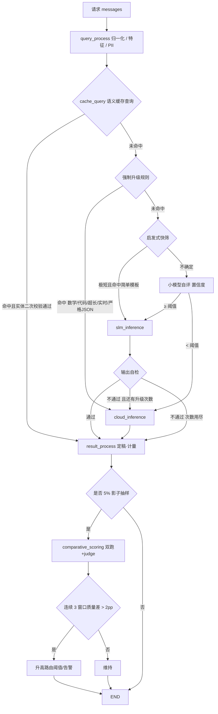

# 代码文件分析

## 文件概述

本空间是 **RouteLLM**——一个「自托管小模型 + 分级成本路由网关」的核心链路实现。代码严格对照根目录 `README.md`（设计文档）落地：用便宜的本地量化小模型吃掉大部分简单流量，只在真正需要时调用云端前沿模型，并用**质量守门闭环**保证「成本降了、质量没塌」。

> 文档说明：本项目经历了一次「模块化拆分重构」（state.py 瘦身、大模块拆到 utils 等），
> 后又按需求**回滚到上一个版本的单文件布局**——状态字段重新集中到 `GraphState`、
> 引擎合回 `flow/graph.py`、config 与 utils 恢复大模块形态。本文档描述的是回滚后的当前代码。

**文件清单与职责：**

| 文件 | 行数 | 模块职责 |
| --- | --- | --- |
| `config/config.py` | 656 | 配置层：环境变量安全读取、零依赖 YAML 子集解析、配置对象、三级装配 + 单例 |
| `config/routing.yaml` | 54 | 配置文件，字段与 README 的 routing.yaml 示例一一对应 |
| `flow/state.py` | 100 | 状态总线 `GraphState`：一次请求在链路上流转的全部字段，按写入方分组 |
| `flow/base.py` | 77 | 节点基类 `BaseNode`：统一契约 + 异常收敛（fail-safe） |
| `flow/graph.py` | 491 | 自写状态图引擎（StateGraph/CompiledGraph）+ `Workflow` 链路装配 + 依赖注入 |
| `flow/node/query_process_node.py` | 115 | 输入处理：归一化、token 估算、启发式特征、实体与 PII 抽取 |
| `flow/node/cache_query_node.py` | 447 | **路由大脑**：语义缓存查询 + 强制升级 + 启发式快筛 + 小模型自评 + 定档 |
| `flow/node/slm_inference_node.py` | 169 | 本地 vLLM 推理 + 输出自检（含流式前缀检查） |
| `flow/node/cloud_inference_node.py` | 99 | 云端强模型推理（兜底出口，失败自行收敛为 error state） |
| `flow/node/result_process_node.py` | 174 | 结果定稿、缓存回写、成本计量、影子流量抽样 |
| `flow/node/comparative_scoring_node.py` | 326 | 影子双跑 + LLM-as-judge 评分 + 守门闭环（judge 逻辑内联于本文件） |
| `utils/heuristics.py` | 383 | 输入侧启发式 + 文本工具：检测、实体抽取、PII、JSON 提取、token 估算 |
| `utils/selfcheck.py` | 120 | 输出自检：拒答词、复读 n-gram、长度、JSON 合法性 |
| `utils/semantic_cache.py` | 336 | 语义缓存：向量（hash 兜底）、相似度、二次校验、三维失效、LRU |
| `utils/llm_client.py` | 509 | 模型客户端全集：异常分层 + HTTP/SSE 传输 + Endpoint + 多 Key 轮转/Fallback |
| `utils/metering.py` | 219 | 计量：分类型 token、成本、延迟分位、Prometheus 文本导出 |
| `utils/guardian.py` | 281 | 守门监控器：稳定抽样、窗口聚合、自动升阈值、一键全量降级 |
| `main.py` | 160 | 演示入口（无真实模型时自动切换内置假后端） |
| `tests/test_smoke.py` | 717 | 端到端冒烟测试，54 个用例（假传输层，无需 GPU/API Key） |

主要解决五个问题（源自 README）：**成本失控**（全打前沿模型）、**延迟虚高**（简单请求排队久）、**数据合规**（需本地推理）、**一刀切风险**（全切小模型会让长尾崩塌）、**收益无法量化**（需 A/B 与持续监控）。

## 整体设计思路

**核心思想：保守路由（Conservative Routing）。** 系统最怕的不是「该升级的没升级」（只是多花钱），而是「复杂请求被误判为简单、用弱模型答错」（直接损害体验且难以发现）。因此所有不确定情形一律升级到强模型——**成本是约束，质量是硬约束**。

**分层架构：**

```
配置层   config/          → 档位、阈值、缓存/守门参数（env > 文件 > 默认值）
支撑层   utils/           → 启发式 / 自检 / 缓存 / 客户端 / 计量 / 守门（无状态、可替换、可单测）
节点层   flow/node/       → 6 个业务节点，只依赖 utils 与 GraphState
编排层   flow/graph.py    → 状态图引擎 + Workflow，负责装配与路由
入口层   main.py          → 演示；生产需再包一层 OpenAI 兼容网关（README 中的 FastAPI 部分未实现）
```

**设计取舍：**

1. **不引入 LangGraph**：只需要「节点 + 静态边 + 条件边」，图规模个位数，自写引擎换来零依赖与完全可控的执行语义。
2. **不引入 PyYAML**：内置受限 YAML 子集解析器，解析失败抛 `ConfigError` 并指出行号——配置错了比没配置更危险，绝不静默兜底。
3. **不引入 requests/httpx**：HTTP 走标准库 `urllib`，传输层抽象成可注入的 `transport`，测试与生产解耦。
4. **状态总线约定**：节点不得原地修改 state（先 `dict(state)` 再改）；全部字段集中在 `GraphState` 声明，引擎对未声明字段告警；时间统一秒、延迟统一毫秒。
5. **依赖注入**：`Workflow` 的 client/cache/meter/guardian 全部可注入，测试用假实现、生产换 Redis/Prometheus 只需替换实现。

**执行流程一句话**：请求进来先做文本分析 → 查语义缓存（命中且通过实体二次校验就直接返回）→ 否则依次过「强制升级规则 → 启发式快筛 → 小模型自评」定档 → 本地推理并做输出自检（不合格升级云端重试一次）→ 定稿、回写缓存、计量、按 5% 抽样进入影子对比与守门。

## 核心模块/类/函数说明

### 配置层 `config/config.py`

- **`LLMConfig`**（dataclass）：通用连接信息（`base_url/api_key/llm_model` 等）；`configured` 判断是否具备调云端的最低条件。
- **`TierConfig`**（frozen dataclass）：一个模型档位。`name/model/endpoint/max_context` + 计费字段（单位统一 **CNY / 百万 token**）+ `gpu_hourly_cost_cny`（本地 GPU 折旧）+ **显式 `local` 字段**。`is_local` 优先取显式声明，避免靠 `endpoint == "upstream"` 猜。
- **`RoutingConfig`**（dataclass）：README routing.yaml 的代码化表示。含路由（`classifier_mode`/`confidence_threshold=0.75`）、强制升级（`force_math_or_code`/`force_context_tokens=24000` 等）、缓存（`semantic_threshold=0.95`/`exclude_pii`/`cache_ttl_hours=72` 等）、守门（`shadow_ratio=0.05`/`max_quality_drop=0.02` 等）与工程参数（超时/重试/`route_budget_ms=15`）。查询方法：`tier()` / `local_tiers`（按上下文升序）/ `frontier_tier()` / `pick_local_tier()`（装不下返回 None 即上云）/ `validate()`。
- **YAML 子集解析与环境读取**：`parse_yaml_subset()` 按缩进递归解析键值/列表/行内数组；`env_str/env_float/env_int` 安全读取环境变量。
- **`load_routing_config(path=None)`**：默认值 → 配置文件 → 环境变量逐级覆盖；模块级单例 `routing_config = load_routing_config()`。

### 支撑层 `utils/`

**`utils/heuristics.py`（输入侧启发式 + 文本工具）**

- `estimate_tokens / estimate_messages_tokens`：无分词器依赖的加权字符估算（仅用于路由阈值，精确计量以后端 usage 为准）。
- `detect_code / detect_math / detect_realtime_data`：强制升级规则的信号源。实时数据检测分强弱信号——弱时间词（今天）单独不成立，避免「今天天气很好」式误判。
- `detect_strict_json / count_instructions / detect_language / match_simple_template`：快筛/严格 JSON 规则用。
- `build_features`：汇总特征供快筛、强制升级、缓存校验复用。
- `extract_entities / entity_consistent / length_ratio_ok`：缓存二次校验（实体集合须完全一致，长度比 0.5–2.0）。
- `detect_pii / extract_json_object`：PII 识别（手机号/身份证/邮箱/银行卡）与从夹带废话的输出里抠 JSON。
- `normalize_text` 等：文本归一化工具。

**`utils/selfcheck.py`（输出体检）**

- `check_output(text, ...)` → `{passed, mode, reasons, ...}`。检查空输出、拒答话术、重复 8-gram 占比、过短、严格 JSON 合法性、置信度下限。
- `mode="prefix"`（流式）只做拒答与复读检查，流结束再补 `full` 检查。

**`utils/semantic_cache.py`（缓存四道闸）**

- `hash_embedding(text, dim=256, ngram=2)`：blake2b hashing trick + L2 归一化，纯标准库、确定性（词面相似，兜底方案；生产注入真实 embedding）。
- `SemanticCache.lookup()` 四道闸：`no_cache` → 含 PII 且 `exclude_pii` → 向量为空 → 相似度 < 0.95 → 实体不一致 → 长度比越界，任一不过即未命中并写明原因。
- `store()` 写前闸门：空答案/拒答不入库（防止一条错误答案被反复返回）。
- 失效三维：命名空间（`model_version|prompt_version`，换模型整体失效）+ TTL 清理 + LRU 容量上限；`hot_entries()/stats()` 供抽检。

**`utils/llm_client.py`（客户端全集）**

- 异常分层：`TransientLLMError`（限流/5xx/超时，可重试）、`AuthLLMError`（401/403，换 Key）、`PermanentLLMError`（重试无意义）、`NoEndpointError`、`AllBackendsFailedError`。
- `Endpoint`：节点 + 运行期健康状态；`mark_unhealthy()` 进冷却（连续失败拉长），`available()` 决定是否参与轮转。
- HTTP 传输层：`urllib_transport / urllib_stream_transport / parse_chat_response / iter_sse_content / ChatResponse`。
- `ChatClient.chat(tier, model, messages, ...)`：Key 轮转 → 节点轮转（起点偏移）→ 指数退避（0.5×2^n + 抖动）；`cached_input_tokens` 单独统计。
- `chat_stream()`：流式不重试，由调用方决定升级或报错。

**`utils/metering.py`**

- `compute_cost(tier, usage, latency_s)`：云端按 input/output/cached_input 分别计价；本地 = GPU 折旧 × 占用时长。
- `Meter`：按 `(tier, cache_hit)` 计数、分档累计成本与 token、有界延迟采样分位（p50/p95/p99）、`render_prometheus()` 文本导出。

**`utils/guardian.py`（守门生命线）**

- `should_shadow(request_id)`：对 request_id 稳定哈希抽样，同一请求结论一致。
- `add_sample(gap)`：累计到 `window_min_samples` 结算；连续 `consecutive_windows` 个窗口超标且过冷却期 → 升阈值（步长 ≤0.05、封顶 0.95）。
- 极端情况：单窗口质量差超阈值 5 倍 → `force_all_frontier = True`（一键全量切强模型，需人工 reset）。
- **只升不降**：降回属人工决策，自动降低会导致省钱/保质量来回横跳。

### 节点层 `flow/node/`

- **`QueryProcessNode`**：`_validate_messages` 校验角色/内容；产出 query、context_tokens、features、entities、pii_types、no_cache、output_format 及默认参数。
- **`CacheQueryNode`**（大脑）：① 缓存查询（命中即定稿）→ ② 守门全量降级 → ③ 强制升级规则（命中即短路）→ ④ 启发式快筛（<50 token + 简单模板 + 指令 ≤2）→ ⑤ 小模型自评（失败/解析不了一律置信度 0）→ ⑥ 阈值比较（优先守门动态阈值）→ ⑦ 定档（本地挑最小能装下的档位）。`_finish` 记录路由耗时并与 15ms 预算对比。
- **`SLMInferenceNode`**：本地推理 + 输出自检；流式边收边做前缀检查，结束后补 full 检查；不通过标记 `self_check_upgrade`。
- **`CloudInferenceNode`**：兜底出口。进入即 `upgrade_count += 1`（防乒乓）；调用失败**收敛成 error state 返回**（不抛给 BaseNode.run，否则状态重建丢失升级计数）；仍做一次输出体检。
- **`ResultProcessNode`**：定稿（缓存 > 云端 > 本地）→ 写缓存（多道闸）→ 计量（分档计价、GPU 折旧、RequestRecord）→ 影子抽样（只对本机 SLM 实际作答的请求抽样）。
- **`ComparativeScoringNode`**：process 只提交后台任务（快照不可变字段）；`_evaluate` 在线程池跑「强模型双跑 → judge 打分 → guardian.add_sample」。judge 解析失败不写样本（脏样本让守门误判），连续失败超阈值告警。

### 编排层 `flow/graph.py`

- **`StateGraph`**：`add_node/add_edge/add_conditional_edges/set_entry_point/compile(max_steps=32)`。编译期校验：入口缺失、边指向未注册节点、静态边与条件边互斥、映射为空——全部提前报错。
- **`CompiledGraph`**：`invoke` 执行到 END；`stream` 逐步产出 `(节点名, 状态快照)`；步数上限防环；`_resolve_next` 条件边优先、其次静态边、都没有即 END；字段拼写检查（合法字段 = GraphState 声明）。
- **`Workflow`**：`_init_nodes`（依赖注入集中地）→ `_register_nodes` → `_setup_routes`；`_route_after_cache_query/_route_after_slm/_route_after_result` 三个路由函数 + `_can_upgrade` 防乒乓；`metrics()/summary()/shutdown()`。
- **`build_chat_client(cfg, api_keys=...)`**：把配置档位变成客户端节点，云端 `upstream` 用 LLM 配置的 base_url，支持多 Key。

## 关键流程梳理

主执行链路（对应 README 主流程图）：



数据流转过程：

1. **接入**：调用方只需传 `{"messages": [...]}`，`request_id` 等默认值由入口节点补齐。
2. **分析**：文本 → features + entities + pii_types + context_tokens，写入 state 供后续节点复用，不重复计算。
3. **缓存**：embedding（哈希向量兜底）→ 余弦相似度 top-1 → ≥0.95 → 实体集合相等 → 长度比合理 → 命中返回（`cached_input_tokens` 计入成本、金额为 0）。
4. **路由**：强制升级规则 → 快筛 → 自评（0.6B，约 8ms）→ 阈值比较（动态）→ 定档（本地取能装下的最小档）。
5. **推理与自检**：本地 vLLM 推理（支持 SSE 流式 + 前缀检查）；自检不过即升级云端一次，升级计数封顶。
6. **收尾**：定稿 → 写缓存（多道闸）→ 计量（分类型 token、GPU 折旧、延迟分位）→ 5% 影子抽样 → 后台 judge → 守门窗口聚合 → 必要时升阈值或全量降级。

## 重要细节与注意点

**关键技术点**

- **路由延迟必须低于收益**：快筛 0ms、自评约 8ms，路由总预算 15ms，超出即告警；强制升级规则命中时短路自评。
- **强制升级不是「作弊」**：4bit 量化对数学（10–20pp）、长上下文、代码、小语种的伤害是实测结论——让小模型干它干得好的那部分。
- **成本口径纪律**：input/output 单价差 3–5 倍，`cached_input_tokens` 必须单独计价；本地必须算 GPU 折旧，否则「本地≈免费」的账是错的。
- **Paired 评测思维**：在线守门逐条对比 SLM 与强模型（同一条输入），比两组平均分对比的统计效力高。

**边界处理（README 边界表逐条落地）**

| 边界情况 | 处理方式 |
| --- | --- |
| 本地 vLLM 实例挂了 | 客户端冷却摘除节点 → 自动切云端；冷却结束自动重新纳入探测 |
| 云端限流/超时 | 多 Key 轮转 + 跨供应商 Fallback 链 + 指数退避（含抖动） |
| 自评模型超时/解析失败 | 置信度按 0 处理 → 保守升级（fail-safe） |
| 缓存命中但实体不一致 | 二次校验拦截，走正常流程并写明原因 |
| 请求含 PII | 不查缓存、不写缓存、优先本地；不得不升级出网时打合规告警 |
| 超长上下文（> 32k） | 强制升级；本地档位装不下时 `pick_local_tier` 返回 None → 上云 |
| 流式输出（SSE） | 前缀检查（拒答/复读）+ 流结束后补完整检查并记录 |
| 模型版本升级 | 缓存命名空间含 `model_version`，换版本即整体失效 |

**依赖**

- 运行时：**纯标准库**（urllib / threading / concurrent.futures / hashlib / dataclasses / json / logging / re），无第三方依赖。
- 外部服务：本地需 vLLM（AWQ/GPTQ 量化）实例；云端需 OpenAI 兼容接口。
- 未实现（需第三方依赖，README 的周边设施）：FastAPI 网关（`web/` 空）、Redis 向量缓存（当前进程内实现，接口可平替）、Prometheus 拉取端（当前提供文本导出）、离线 paired 评测与 bootstrap 检验。

**特殊逻辑与坑**

- **Python 3.12+ 推导式内联（PEP 709）**：推导式变量若与函数体内后续同名局部变量撞名会触发 `UnboundLocalError`，代码中统一用不冲突的变量名。
- **`TierConfig.local` 必须显式声明**：曾靠 `endpoint == "upstream"` 推断，导致真实云端 URL 被判为本地。
- **云端节点自行收敛异常**：若抛给 `BaseNode.run`，错误状态基于旧 state 重建，`upgrade_count` 自增会丢失。
- **judge 失败不写样本**：宁可少一个样本也不要假信号。
- **启发式固有局限**：规则覆盖不全、易误伤；判不了交给自评，自评判不了升级——三层兜底是设计，不是缺陷。
- **哈希向量只是兜底**：词面相似，生产必须注入真实 embedding 模型。

**潜在风险**

1. 进程内缓存不可跨实例共享、无持久化；真实 embedding 开销（约 5ms）需纳入路由预算。
2. PII 正则只能覆盖强模式（手机号/身份证/邮箱/银行卡），合规敏感场景需专业 DLP。
3. judge 依赖模型稳定输出 JSON，格式漂移会让守门静默失效（已有连续失败告警兜底）。
4. 阈值只升不降，长期运行可能停在偏高位置，需人工确认质量后 `guardian.reset()`。
5. `routing.yaml` 中 frontier 单价为示例值，上线前必须替换为真实报价。
6. 无并发压测数据；多线程安全（RLock/Lock）但未做高 QPS 验证。
7. 缺少服务化外壳（HTTP 网关/鉴权/限流/审计），当前定位是库。

## 总结

**优点**

- 设计文档还原度高：README 主流程图、边界处理表、失败案例逐条落地，关键决策都有注释说明。
- 保守路由贯彻到底：三层兜底（置信度阈值 + 强制升级规则 + 输出自检）+ 失败路径全部 fail-safe。
- 工程质量扎实：零第三方依赖、依赖注入、编译期校验、异常分层、状态不可变约定、54 个冒烟测试覆盖边界场景（含「北京/上海限行」事故复现）。
- 可观测性好：每个请求留痕（路由理由、未命中原因、警告、trace、分档成本/延迟），Prometheus 文本导出可用。

**不足**

- 服务化外壳缺失，当前是库而非可独立部署的服务。
- 缓存为进程内实现，多副本场景需替换 Redis 后端；embedding 兜底能力有限。
- 启发式规则存在误判（保守策略把代价控制在「多花钱」范围内，但侵蚀成本收益）。
- 缺少离线 paired 评测与 bootstrap 置信区间实现。
- 无并发/长跑压测数据，阈值自愈只升不降需人工介入。

**适用场景**

- 适合：请求量大（日请求万级以上）、难度分布差异大（大量格式转换/分类/抽取/改写 + 少量复杂推理）、需控制推理成本或有数据不出内网要求的业务；也适合作为「成本优化 + 质量守门」方法论的参考实现。
- 不适合：请求量小到 GPU 空转成本超过 API 费用的场景；对延迟抖动零容忍且无法接受保守升级开销的场景；强合规且 PII 类型复杂的场景（需先补 DLP）。
