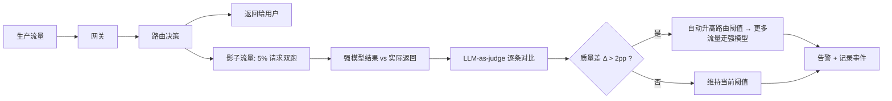
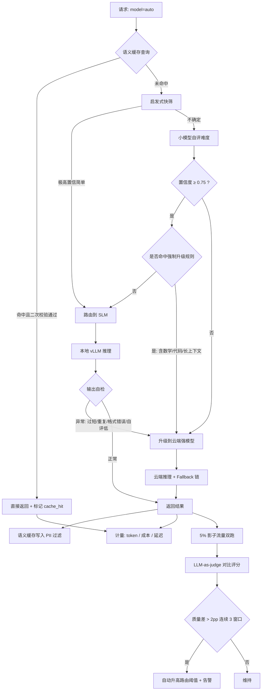

# RouteLLM · 自托管小模型 + 分级成本路由网关

> 用便宜模型吃掉大部分简单流量，只在真正需要时调用前沿模型。
> 解决的问题：**「什么都用最强模型」不是技术选型，是财务事故。**

```bash
# 启动本地推理池 + 网关（OpenAI 兼容接口，业务侧零改造接入）
docker compose up -d           # vLLM(SLM) + Redis + Prometheus + Gateway
poetry install
poetry run routellm serve --config config/routing.yaml
curl http://localhost:8000/v1/chat/completions -d '{"config":"auto","messages":[...]}'
```

---

## 文件概述

### 本文件的作用

本文件是 `routellm` 项目的设计文档，说明**分级路由的判定逻辑、质量守门机制、成本与延迟的计量方法、以及量化部署中的坑**。
项目的价值不在"接了个小模型"，而在**证明成本降下来之后质量没塌**——后者才是工程难点。

### 承担的模块职责

| 模块 | 目录 | 职责 |
| --- | --- | --- |
| 统一网关 | `routellm/gateway/` | OpenAI 兼容 API，屏蔽后端多模型差异，统一鉴权与计量 |
| 难度路由 | `routellm/router/` | 请求复杂度判定与模型选择，含置信度与保守升级策略 |
| 本地推理池 | `routellm/pool/` | vLLM 多实例管理、模型常驻/按需加载、显存规划、健康检查 |
| 云端回退 | `routellm/upstream/` | 前沿模型供应商接入、多 Key 轮转、Fallback 链 |
| 语义缓存 | `routellm/cache/` | embedding 相似度缓存、失效策略、PII 过滤 |
| 质量守门 | `routellm/guardian/` | 影子流量对比、抽样 LLM-as-judge、自动降级与回滚 |
| 计量监控 | `routellm/metering/` | token 与成本计量、延迟分位、路由分布、Prometheus 导出 |

### 主要解决什么问题

1. **成本失控**：所有请求都打前沿模型，日活一上来账单就失控，且其中 70% 以上的请求（格式转换、简单改写、分类、抽取）根本不需要那么强的模型。
2. **延迟 unnecessarily 高**：前沿模型大、排队久。简单请求用 0.6B 本地模型，首字延迟可以从 800ms 降到 60ms。
3. **数据合规**：不少场景（医疗、金融、政务）数据不能出内网，必须有本地推理能力。
4. **一刀切的风险**：简单地「全切小模型」会让长尾复杂请求质量崩塌。需要的是**按难度分流**，而不是整体替换。
5. **无法量化收益**：没有 A/B 验证和持续监控，成本优化就是拍脑袋。

---

## 整体设计思路

### 核心思想：保守路由（Conservative Routing）

路由最怕的不是"该升级的没升级"——那只是多花点钱。**最怕的是"该用小模型却用了大模型"反过来：复杂请求被误判为简单，用弱模型答错**——那会直接损害用户体验，且往往很难被发现。

所以本系统的核心策略是**宁可高配，不可错配**：

- 路由器输出的是一个**难度分布 + 置信度**，而不只是一个标签；
- 置信度低于阈值 → **一律升级到强模型**（花钱买安全）；
- 目标是**质量损失可控**，而不是成本最低。成本是约束条件，质量是硬约束。

用一句话概括：**这个项目优化的是成本，但它的正确性由质量守门来保证。**

### 路由判定的三种方案与取舍

| 方案 | 做法 | 优点 | 缺点 | 适用 |
| --- | --- | --- | --- | --- |
| 启发式规则 | token 长度、是否含代码/数学符号、指令条数、语种 | 零延迟、零成本、可解释 | 覆盖不全，容易被绕过 | 作为**第一道快速通道** |
| 小模型自评 | 让 SLM 预测「这道题 SLM 答得了吗」 | 成本低（< 10ms）、泛化好 | 弱模型难以准确评估自身边界 | 主力方案 |
| 训练分类器 | 用历史数据训练难度分类器（BERT / 线性模型 on embedding） | 最准 | 需要标注数据、有维护成本、分布漂移后要重训 | 数据积累足够后的终态 |

**本项目采用「启发式 + 小模型自评」的两级串联，并在数据积累后平滑过渡到分类器：**

1. 启发式先跑，极高置信的简单请求（如长度 < 50 token 且命中已知简单模板）直接路由到 SLM，零额外开销；
2. 其余请求走小模型自评（约 8ms，本地 0.6B 模型）；
3. 自评置信度 < 0.75 的一律升级到云端强模型。

实测三档流量分布：**SLM 处理 78%**、云端处理 22%（其中约 6% 是保守误升级，属于计划内的成本）。

### 质量守门：影子流量 + 抽样评测 + 自动回滚

这是本项目最容易被忽略、但最不该忽略的部分。**没有守门的成本优化就是赌博。**



三层保障：

1. **离线验证（上线前）**：人工 paired 评测，用小模型结果 vs 强模型结果逐条对比，计算质量差与 **bootstrap 95% 置信区间**。只有置信区间上界 < 2pp 才允许调整路由阈值。
2. **影子流量（上线中）**：5% 请求在后台双跑强模型，用 judge 评分对比，**不返回给用户**，纯监控。
3. **自动降级（出问题时）**：质量差连续 3 个窗口超过阈值 → 自动升高路由阈值（更多流量走强模型）；极端情况下一键全量切到强模型。降级必须**自动**——靠人发现就晚了。

### 语义缓存：收益最大也最危险的一招

语义缓存（相似问题复用历史答案）能把缓存命中场景的成本打到接近零，但风险也最大：

- **相似度阈值**：余弦相似度 ≥ 0.95 才命中。低于这个值，形似神不似的 query 会拿到错误答案（「北京限行规则」vs「上海限行规则」）。
- **二次校验**：命中后不直接返回，先用一个轻量检查（query 长度比、关键实体是否一致——地名/时间/金额/产品型号必须完全一致）做二次确认。
- **不一致即不缓存**：涉及实时数据的 query（「今天股价」「当前库存」）打上 `no_cache` 标记。
- **PII 绝不缓存**：命中检测阶段就要过滤含个人信息的 query，避免 A 用户的答案被返回给 B 用户。
- **失效策略**：按 `模型版本 + prompt 版本 + 时间窗口` 三维失效。模型一升级，缓存必须整体失效——**这一条不做到位，会出现"换了模型但用户看到的还是旧模型的答案"这种极其难排查的问题**。

### 量化：哪些能力会掉，掉多少

自部署 SLM 离不开量化。AWQ / GPTQ 4bit 能把显存压到 1/3~1/4，但**不是所有能力均匀下降**：

| 能力 | 4bit 量化后表现 | 说明 |
| --- | --- | --- |
| 通用文本生成、摘要、改写 | 几乎无损（< 1pp） | 这类任务对精度不敏感 |
| 分类、抽取、格式化输出 | 几乎无损 | 最适合作 SLM 场景 |
| 多轮指令跟随（3 轮以上） | 轻微下降（2–4pp） | 长上下文下误差累积 |
| 数学计算、多步推理 | **明显下降（10–20pp）** | 对精度敏感，量化误差被推理链放大 |
| 长上下文（> 32k）信息检索 | **明显下降** | KV cache 量化后长程依赖衰减 |
| 多语言（尤其小语种） | 中等下降（5–8pp） | 权重压缩对小语种表征伤害更大 |
| 代码生成 | 中等下降 | 语法错误率上升明显 |

**直接影响路由规则**：涉及数学、代码、长上下文的请求，**即使自评认为简单，也强制升级到强模型**。这条规则看起来是"作弊"，实际上是正确的工程量体裁衣——你不是要让小模型什么都能干，而是让它干它干得好的那部分。

### vLLM 部署要点

- **Continuous batching** 是吞吐的关键，不要用朴素的逐请求推理。
- **显存规划**：`模型权重 + KV cache + 激活值` 必须留够。KV cache 不足会导致并发一上来就抢占、吞吐断崖式下跌。公式：`可用显存 = 总显存 × 0.9 − 权重`。
- **多模型共卡**：vLLM 支持 `--gpu-memory-utilization` 切分，但更好的做法是用 `max-model-len` 限制每个实例，避免长请求撑爆。
- **Prefix caching**：系统 prompt 通常很长且固定，开启 prefix caching（自动前缀缓存）对命中率高的场景能省 30%+ 的 prefill 计算。
- **冷启动**：小模型加载也需要 10~30s。策略是常驻 1~2 个高频模型 + 低频模型按需加载（配合 LRU 淘汰）。

---

## 关键流程梳理

### 主执行链路



### 数据流转过程

1. **接入**：业务方把 `base_url` 指向网关、`model` 填 `auto`，其余代码零改动——这是 OpenAI 兼容接口的最大价值。
2. **缓存查询**：query → embedding（本地小 embedding 模型，约 5ms）→ Redis 向量检索 top-1 → 相似度 ≥ 0.95？→ 二次校验（关键实体一致性检查）→ 命中则返回。
3. **路由判定**：启发式快筛（< 1ms）→ 未命中则小模型自评（约 8ms）→ 输出难度 + 置信度 → 叠加强制升级规则（数学/代码/长上下文/PII）→ 最终路由决策。
4. **推理执行**：SLM 走本地 vLLM；强模型走云端（多 Key 轮转 + 供应商 Fallback，某家挂了自动切下一家）。
5. **输出自检**：SLM 结果做轻量检查（长度异常、重复 n-gram、JSON 格式是否合法、是否含拒答词）。**自检不通过直接升级到强模型重试**——这是"保守路由"的第二道保险。
6. **返回与缓存**：返回给用户 → 异步写语义缓存（PII 过滤后）→ 写计量数据。
7. **守门**：5% 影子流量在后台双跑强模型 → judge 对比 → 写入时序库 → 连续超阈值触发自动降级。
8. **计量**：每个请求记录 `input_tokens / output_tokens / cache_hit / 路由档位 / 实际成本 / 各阶段耗时`，导出到 Prometheus，Grafana 面板展示成本趋势与路由分布。

### 关键配置

```yaml
routing:
  tiers:
    - name: slm_tiny
      model: qwen3-0.6b-awq
      endpoint: http://vllm-tiny:8000
      max_context: 8192
    - name: slm_mid
      model: qwen3-8b-awq
      endpoint: http://vllm-mid:8000
      max_context: 32768
    - name: frontier
      model: claude-frontier-2026-08-01
      endpoint: upstream
  classifier:
    mode: tiny_model_self_eval     # heuristic | tiny_model_self_eval | trained
    confidence_threshold: 0.75
  force_upgrade_rules:            # 命中即强制用 frontier
    - contains_math_or_code
    - context_tokens > 24000
    - requires_realtime_data
    - output_format == strict_json
  cache:
    semantic_threshold: 0.95
    entity_consistency_check: true
    exclude_pii: true
    ttl_hours: 72
    invalidate_on: [model_version, prompt_version]
  guardian:
    shadow_ratio: 0.05
    max_quality_drop: 0.02
    consecutive_windows: 3
    auto_rollback: true
```

---

## 重要细节与注意点

### 关键技术点

- **路由的延迟必须低于收益**。如果路由判定本身花 200ms，那省下的推理时间就没了。所以自评模型用 0.6B（约 8ms），启发式 < 1ms。总路由开销必须控制在 **15ms 以内**。
- **成本要按 token 类型分别算**。input 和 output 单价通常差 3~5 倍，缓存命中的 input 又有折扣。计量不准，优化方向就会错。必须把 `cached_input_tokens` 单独统计。
- **paired 评测而不是两组均值**。比较 SLM 与强模型时，用同一批样本逐条对比并计算差值的置信区间，统计效力远高于比较两组的平均分。样本量少一半也能得出可靠结论。
- **bootstrap 置信区间**：质量差的点估计（比如 1.8pp）没有意义，必须报告 95% 置信区间（比如 [0.9pp, 2.9pp]）。**只有区间上界 < 2pp 才算通过**——这是简历上"质量下降不超过 2pp"这句话的正确打开方式。
- **量化校准集要贴近真实分布**。AWQ/GPTQ 的校准效果依赖校准数据。用通用语料校准，然后在自己的垂类业务上跑，效果会明显打折。务必用**自己的业务数据**做校准。

### 边界处理

| 边界情况 | 处理方式 |
| --- | --- |
| 本地 vLLM 实例挂了 | 健康检查 + 自动切云端；同时摘除节点，恢复后重新加入 |
| 云端供应商限流 / 超时 | 多 Key 轮转 + 跨供应商 Fallback 链 + 指数退避 |
| 自评模型本身超时 | 超时按"不确定"处理 → 保守升级到强模型（fail-safe） |
| 缓存命中但实体不一致 | 二次校验拦截，走正常流程 |
| 请求含 PII | 打标 `exclude_pii`，不写缓存；且路由时优先本地推理不出网 |
| 超长上下文（> 32k） | 强制升级；本地 SLM 上下文不够，硬塞会截断丢失信息 |
| 流式输出（SSE） | 流式场景下输出自检只能做前缀检查，需在完整流结束后异步补检并记录 |
| 模型版本升级 | 缓存按版本键整体失效；路由阈值重新跑一轮离线验证 |

### 潜在风险

1. **质量静默下降**（最高风险）。成本省下来了，质量慢慢塌了，但没人发现——因为用户不会投诉，只会流失。质量守门不是可选项，是这个项目的生命线。**必须绑定业务指标**（用户重问率、点踩率、任务完成率）而不只是 judge 分数。
2. **缓存污染**。一条错误答案被缓存后，会被反复返回给后续查询。必须：写缓存前做质量校验；提供一键清除接口；对命中率异常高的 key 做人工抽检。
3. **分布漂移**。业务上线新功能后，请求分布变了，路由阈值不再合适。守门机制的漂移告警 + 定期重跑离线验证（建议每月一次）。
4. **被用户利用降级**。如果用户发现某些 query 会走弱模型，可能构造输入来"骗取"低质量输出（或反过来消耗成本）。需要对异常 query 模式做监控。
5. **过度优化导致复杂度失控**。三档模型 + 缓存 + 守门，运维复杂度不低。如果业务量不大（日请求 < 1 万），直接调强模型可能更划算。**做之前先算一笔账**：省下的钱是否覆盖了建设和维护成本？这个判断本身也是工程能力的体现。

### 依赖

- **推理**：vLLM（continuous batching、prefix caching、AWQ/GPTQ 量化支持）
- **模型**：Qwen3-0.6B / 8B（AWQ 4bit）、本地 embedding 模型（BGE-small，缓存与自评用）
- **缓存**：Redis（含向量检索能力，用 Redis Stack 或 RediSearch）
- **网关**：FastAPI + LiteLLM（供应商适配层，不建议直接用它的路由逻辑，自己实现可控性更好）
- **监控**：Prometheus + Grafana（成本趋势、路由分布、延迟分位、质量差时序）
- **评测**：对接 `01-llm-eval-observability` 做 judge 与 paired 检验

### 特殊逻辑说明

- **为什么路由阈值是动态的而不是写死的**：业务分布会变、模型会升级、成本会变。守门机制根据实测质量差自动调整阈值，比人工调参靠谱得多。阈值调整要有**变化率限制**（每次最多调整 0.05）和**冷却期**，避免震荡。
- **"质量下降 2pp"这个数字怎么来的**：不是拍脑袋。离线用 400 条代表性样本做 paired 评测（人工 + judge 双评），计算 SLM 相对强模型的质量差，取 bootstrap 95% 置信区间上界。上线后用影子流量持续验证。
- **成本数字的口径**：必须说明是"整体推理成本"还是"单请求平均成本"，是否含缓存命中（命中的请求成本近似为 0，会让平均值很好看但失真）。简历上写数字时，口径说不清反而减分。
- **本地模型的隐性成本**：GPU 是固定开支，不是按量付费。如果业务量小，GPU 空转的成本可能超过调 API。**做成本对比时必须把 GPU 折旧算进去**，否则账是错的。

### 失败案例（Bad Cases）

| 案例 | 现象 | 根因 | 改进 |
| --- | --- | --- | --- |
| 数学题大面积答错 | 路由到 SLM 后计算题错误率翻倍 | 量化对数学推理伤害大，但自评判为简单 | 加 `contains_math_or_code` 强制升级规则 |
| 缓存返回错误答案 | 问「上海限行」返回了「北京限行」 | 相似度 0.93 但实体不同 | 阈值提到 0.95 + 实体一致性二次校验 |
| 换了模型答案没变 | 升级后用户仍看到旧答案 | 语义缓存未按模型版本失效 | 缓存键加入 model_version，升级即失效 |
| 成本降了但质量悄悄塌了 | 成本 -87%，两周后点踩率上升 | 只有离线验证，无持续守门 | 加影子流量 + judge 对比 + 自动回滚 |
| 显存 OOM 导致吞吐暴跌 | 并发一上来 P99 从 1.1s 涨到 9s | KV cache 预留不足，请求抢占 | 重算显存分配，限制 max-model-len |
| 长文档摘要丢信息 | 32k 文档摘要漏掉后半部分 | SLM 长上下文量化后衰减 | 长上下文强制升级到强模型 |

---

## 项目结构

```
routellm/
├── routellm/
│   ├── gateway/        # OpenAI 兼容 API、鉴权、流式
│   ├── router/         # 启发式 + 自评 + 分类器三级路由
│   ├── pool/           # vLLM 实例管理、健康检查、显存规划
│   ├── upstream/       # 云端供应商接入与 Fallback 链
│   ├── cache/          # 语义缓存、PII 过滤、失效策略
│   ├── guardian/       # 影子流量、judge 对比、自动降级
│   └── metering/       # 成本与延迟计量、Prometheus 导出
├── config/             # 路由配置、模型档位定义
├── evals/              # paired 评测脚本、bootstrap 检验
├── dashboards/         # Grafana 面板 JSON
└── tests/
```

## 简历描述参考

> 设计分级模型路由网关：按任务复杂度把流量分发给 0.6B / 8B **本地量化模型**与云端前沿模型，采用「启发式快筛 + 小模型自评 + 强制升级规则」三级路由（路由开销 < 15ms），叠加语义缓存与 prefix caching；实现**影子流量 + LLM-as-judge + 自动降级**的质量守门闭环；通过 400 条样本的 paired 人工评测与 bootstrap 检验，在质量下降**不超过 2pp（95% 置信区间上界）**的前提下，推理成本**下降 87%**，P99 延迟从 **4.2s 降至 1.1s**，SLM 承载 **78%** 流量。

## 面试必被追问

1. **路由分类器自己判错了怎么办？** → 三层兜底：置信度低于 0.75 一律保守升级（fail-safe）；数学/代码/长上下文走强制升级规则；SLM 输出做自检（异常即升级重试）。设计原则是宁可多花钱，不可答错。
2. **"质量只降 2pp"怎么测出来的？** → 400 条代表性样本做 paired 评测（同一条分别用 SLM 和强模型生成，人工 + judge 双评），计算逐条质量差，bootstrap 1000 次取 95% 置信区间，要求**上界** < 2pp。上线后用 5% 影子流量持续验证。
3. **量化之后哪些能力掉得最厉害？** → 数学多步推理（10–20pp）和长上下文检索掉得最厉害，因为量化误差会被推理链和长程依赖放大；小语种中等下降；摘要/改写/分类/抽取几乎无损。所以路由规则里对数学、代码、长上下文做了强制升级。
4. **成本账算全了吗？** → 关键是要把 GPU 折旧（固定成本，非按量付费）算进去，并说明成本口径是整体推理成本还是单请求均值、是否含缓存命中。业务量小于日请求 1 万时，直接调 API 可能更划算——做之前先算这笔账。
