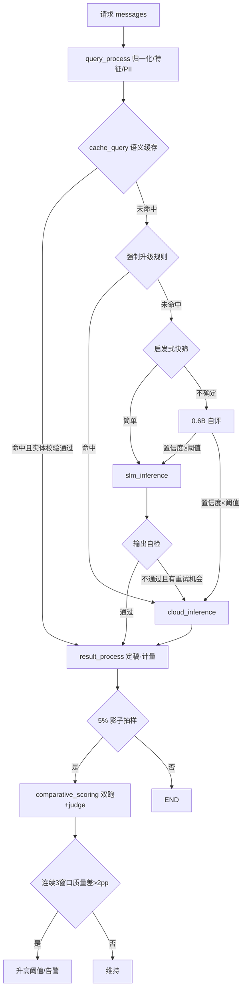

# 代码文件分析

## 文件概述

本空间是 **RouteLLM**——一个「自托管小模型 + 分级成本路由网关」的核心链路实现。代码严格对照根目录 `README.md`（设计文档）落地：用便宜的本地量化小模型吃掉大部分简单流量，只在真正需要时调用云端前沿模型，并用**质量守门闭环**保证「成本降了、质量没塌」。

**文件清单与职责（重构后，全部模块 ≤ 300 行）：**

| 文件 | 行数 | 模块职责 |
| --- | --- | --- |
| `config/models.py` | 248 | 配置数据结构：三档档位、阈值、缓存/守门参数与取值校验 |
| `config/loader.py` | 251 | 默认值 → 配置文件 → 环境变量的三级装配 |
| `config/config.py` | 42 | 配置入口（门面）：统一对外导入 + 模块级单例 |
| `config/routing.yaml` | 54 | 配置文件，字段与 README 示例一一对应 |
| `flow/state.py` | 59 | 公共状态总线 `GraphState`（只留跨节点公共字段）+ 字段汇总工具 |
| `flow/base.py` | 80 | 节点基类：统一契约、异常收敛、`state_schema` 注册 |
| `flow/engine.py` | 237 | 自写状态图引擎（StateGraph / CompiledGraph）+ 字段拼写校验 |
| `flow/graph.py` | 291 | `Workflow` 链路装配 + 条件路由 + 客户端工厂 |
| `flow/node/query_process_node.py` | 132 | 输入处理：归一化、token 估算、特征/实体/PII 抽取 |
| `flow/node/cache_query_node.py` | 270 | **路由大脑**：缓存查询 + 强制升级 + 快筛 + 自评 + 定档 |
| `flow/node/slm_inference_node.py` | 175 | 本地 vLLM 推理 + 输出自检（含流式前缀检查） |
| `flow/node/cloud_inference_node.py` | 104 | 云端强模型推理（兜底出口） |
| `flow/node/result_process_node.py` | 174 | 结果定稿、缓存回写、成本计量、影子抽样 |
| `flow/node/comparative_scoring_node.py` | 201 | 影子双跑 + judge 评分 + 守门闭环（后台线程） |
| `utils/heuristics.py` | 186 | 特征检测：代码/数学/实时数据/指令数/语种/简单模板 |
| `utils/text_utils.py` | 215 | 文本基础：归一化、token 估算、实体抽取、PII、JSON 提取 |
| `utils/embedding.py` | 57 | 向量工具：哈希 embedding 兜底 + 余弦相似度 |
| `utils/selfcheck.py` | 120 | 输出自检：拒答词、复读 n-gram、长度、JSON 合法性 |
| `utils/self_eval.py` | 122 | 小模型自评能力（难度打分，fail-safe） |
| `utils/judge.py` | 142 | LLM-as-judge 能力（双跑 + 打分 + 脏样本拦截） |
| `utils/semantic_cache.py` | 299 | 语义缓存：相似度、二次校验、三维失效、LRU |
| `utils/endpoint.py` | 87 | 模型节点：健康状态、多 Key 轮转、冷却摘除 |
| `utils/llm_errors.py` | 34 | 模型调用异常分层（决定能否重试） |
| `utils/http_transport.py` | 191 | urllib 传输 + OpenAI 兼容响应解析 + SSE |
| `utils/llm_client.py` | 256 | 模型客户端：按档位轮转 / 回退 / 重试 |
| `utils/route_helpers.py` | 100 | 路由落点纯函数（写本地/云端档位、记录路由耗时） |
| `utils/yaml_subset.py` | 150 | 受限 YAML 子集解析（零依赖） |
| `utils/env.py` | 53 | 环境变量安全读取 |
| `utils/metering.py` | 219 | 计量：分类型 token、成本、延迟分位、Prometheus 导出 |
| `utils/guardian.py` | 281 | 守门监控器：稳定抽样、窗口聚合、自动升阈值、一键降级 |
| `main.py` | 160 | 演示入口（无真实模型自动切换假后端） |
| `tests/helpers.py` + 7 个测试文件 | 625 | 端到端测试，54 用例（假传输层） |

主要解决五个问题（源自 README）：成本失控、延迟虚高、数据合规、一刀切风险、收益无法量化。

## 整体设计思路

**核心思想：保守路由（Conservative Routing）**——最怕的不是「该升级没升级」（只是多花钱），而是「复杂请求被误判为简单、用弱模型答错」（直接损害体验且难以发现）。因此所有不确定情形一律升级强模型：**成本是约束，质量是硬约束**。

**分层架构（依赖单向无环）：**

```
config/  配置数据模型与加载        ← 被所有模块引用
utils/   通用工具箱（无状态、可替换、可单测）← 被节点/编排引用
flow/    状态总线 → 节点 → 图引擎 → Workflow 装配 → main 入口
```

**重构原则（2026-09-03）**：
1. `flow/state.py` 只放全链路公共字段（入口/出口契约、计量、引擎维护项）；每个节点私有字段声明在**各自模块顶部**（`class XxxState(GraphState)`），并注册 `state_schema`，图引擎汇总后对状态字段做拼写校验——读一个文件就能看懂一个节点的输入输出契约。
2. 通用能力按职责分类下沉 `utils/`：文本处理（text_utils）、向量（embedding）、特征检测（heuristics）、自评（self_eval）、评审（judge）、路由落点（route_helpers）、网络（llm_errors/http_transport/endpoint/llm_client）等。模块自己的私有逻辑以 `_` 前缀保留在模块内。
3. 图引擎独立为 `flow/engine.py`，`flow/graph.py` 只负责装配。
4. 测试按主题拆分（helpers + 7 个 test_*.py），以 `python -m unittest discover -s tests` 运行。

**执行流程一句话**：请求进来先做文本分析 → 查语义缓存（命中且实体二次校验通过就直接返回）→ 否则依次过「强制升级规则 → 启发式快筛 → 小模型自评」定档 → 本地推理 + 输出自检（不合格升级云端一次）→ 定稿、回写缓存、计量、5% 影子对比守门。

## 核心模块/类/函数说明

### 配置层 `config/`
- `RoutingConfig`（models.py）：README routing.yaml 的代码化表示；提供 `tier()/local_tiers/frontier_tier()/pick_local_tier()/validate()`。
- `TierConfig`：档位模型；`is_local` 显式声明优先，不靠 endpoint 字符串猜测。
- `load_routing_config`（loader.py）：默认值 → 配置文件 → 环境变量逐级覆盖；强制升级规则列表即事实来源（没写的规则关闭）。

### 状态与图 `flow/`
- `GraphState`（state.py）：公共字段 = `request_id/messages/query/normalized_query/final_output/final_tier/usage/cost_cny/latency_ms/error/warnings/trace`；`state_fields()` 汇总校验集合。
- `BaseNode`（base.py）：`run()` 统一异常收敛（节点异常记入 `state["error"]`，不炸链路）；子类注册 `state_schema`。
- `StateGraph/CompiledGraph`（engine.py）：节点注册、静态边、条件边；编译期校验入口/边/分支；运行期步数上限防环；路由函数返回未注册分支即报错；`stream()` 逐步产出状态快照。
- `Workflow`（graph.py）：`_init_nodes`（依赖注入集中地）→ `_register_nodes` → `_setup_routes`（两条条件边 + 两条静态边）；三个路由函数 + `_can_upgrade` 防乒乓；`metrics()/summary()/shutdown()`。

### 支撑层 `utils/`（选要者）
- `heuristics`：`detect_code/math/realtime_data/strict_json`、`count_instructions`、`match_simple_template`、`build_features`。
- `text_utils`：`estimate_tokens/estimate_messages_tokens`（加权字符法）、`extract_entities`、`entity_consistent`（集合完全相等）、`length_ratio_ok`、`detect_pii`、`extract_json_object`。
- `selfcheck.check_output`：空输出/拒答/复读 8-gram/过短/JSON 合法性；`mode="prefix"` 只做拒答与复读。
- `self_eval.evaluate_difficulty`：0.6B 自评，失败一律置信度 0（fail-safe）。
- `judge.run_shadow_evaluation`：强模型双跑 + judge 打分，`gap=(B-A)/10`；解析失败不写样本。
- `semantic_cache.SemanticCache`：四道闸（no_cache / PII / 相似度 / 实体一致性 + 长度比）；命名空间按 model_version|prompt_version 归档，天然整体失效。
- `llm_client.ChatClient`：多 Key 轮转 + Fallback 链 + 指数退避 + 冷却摘除；`endpoint.py` 管节点健康。
- `metering`：分类型 token 计价（`compute_cost`），本地按 GPU 折旧×占用时长；Prometheus 文本导出。
- `guardian.GuardianMonitor`：`should_shadow`（稳定哈希抽样）、窗口聚合、连续 N 窗超标升阈值（步长 ≤0.05 + 冷却）、极端一键 `force_all_frontier`；只升不降。
- `route_helpers`：`route_to_local/route_to_frontier/record_route_latency` 纯函数。

### 节点层 `flow/node/`（6 个）
见「关键流程」；各自顶部声明私有状态 schema，依赖全部注入。

## 关键流程梳理



## 重要细节与注意点

**关键技术点**：路由总预算 15ms（超时告警）；强制升级规则短路自评省 8ms；`cached_input_tokens` 单独统计计价；本地成本必须算 GPU 折旧；judge 脏样本不写守门；PEP 709 推导式内联的变量撞名坑（推导式变量用 `item`）；云端节点自行收敛异常以保留升级计数；字段拼写由引擎按「公共 schema ∪ 节点 schema」校验。

**边界处理**：本地实例挂 → 冷却摘除 + 自动切云端；云端限流 → 多 Key/多节点/退避；自评失败 → 置信度 0 保守升级；缓存实体不一致 → 二次校验拦截；PII → 不查不写缓存、优先本地；超长上下文 → 强制升级；SSE → 前缀检查 + 流结束补检；换模型 → 缓存命名空间整体失效。

**依赖**：运行时纯标准库；外部需 vLLM（本地）与 OpenAI 兼容云端接口；未实现（需第三方依赖）：FastAPI 网关、Redis 向量缓存（接口已预留）、Prometheus 拉取端、离线 paired 评测与 bootstrap 检验。

**潜在风险**：进程内缓存不可跨实例共享；PII 正则只覆盖强模式；judge 依赖模型稳定输出 JSON；守门阈值只升不降需人工 reset；routing.yaml 价格为占位值；无高 QPS 压测数据；无服务化外壳（鉴权/限流）。

## 总结

**优点**：设计文档还原度高（主流程图/边界表/失败案例/成本口径逐条落地）；保守路由三层兜底 + 全失败路径 fail-safe；纯标准库、分层清晰、依赖注入、编译期校验、异常收敛不炸链路；重构后模块内聚性更强（公共状态瘦身、私有字段就近声明、通用能力下沉 utils）、单模块 ≤300 行、可读性好；54 用例覆盖边界与历史事故复现。

**不足**：无服务化外壳；缓存为进程内实现需替换 Redis；启发式规则有误判（代价已控制在「多花钱」侧）；缺少离线 paired 评测与 bootstrap 检验；守门只升不降需人工介入。

**适用场景**：请求量较大、难度分布差异明显、要控成本或数据不出内网的业务；也适合作为「成本优化 + 质量守门」方法论的参考实现。请求量小到 GPU 空转成本超过 API 费用时不宜使用（README 的提醒）。
